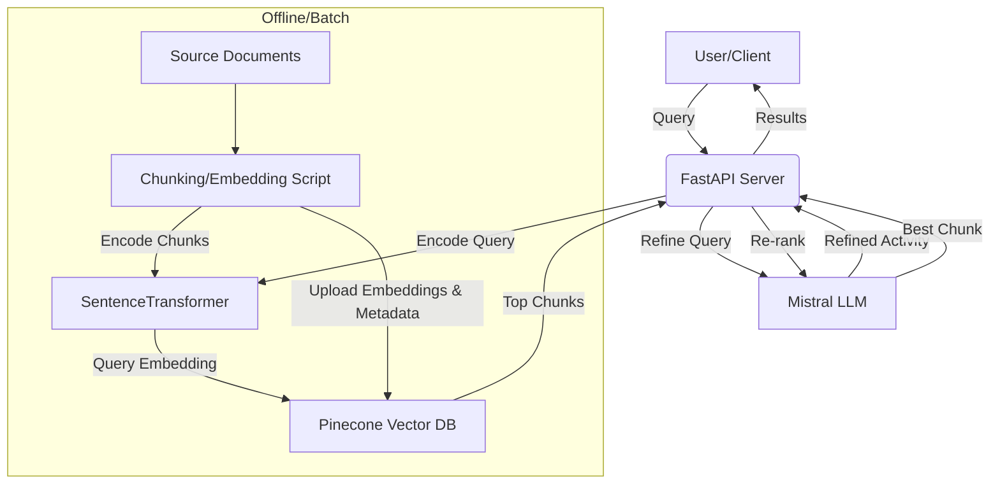

# BillQuant RAG Server (DEI)


## Introduction

This server is dedicated to searching and retrieving items from the official DEI price list (Prezziario). All price list files and data are sourced directly from the official DEI source: [https://drive.google.com/file/d/1BQ0viud_XqSbwt6velO8ttKEvk9casQC/view?usp=drive_link](https://drive.google.com/file/d/1BQ0viud_XqSbwt6velO8ttKEvk9casQC/view?usp=drive_link).

**What is DEI?**

DEI stands for "DEI Tipografia del Genio Civile," a renowned Italian technical publisher. The DEI Prezziario is a national, standardized construction cost list published by DEI Tipografia del Genio Civile. It is widely used across Italy for public and private works, especially when a regional price list is not available or for benchmarking purposes.

**How does the DEI Prezziario differ from regional price lists?**

- The DEI Prezziario is a national reference, not tied to any specific region, and provides standardized construction prices for the whole country.
- Regional price lists (e.g., Piemonte, Trento) are published by local authorities and reflect local regulations and market conditions.
- The DEI Prezziario is often used as a benchmark or when no regional list is available.

**Important:** The DEI price list is updated periodically. To ensure price accuracy and compliance, the files and embeddings used by this server must be updated each year or whenever a new official version is released.

## Architecture Diagram


The BillQuant RAG Server (DEI) is designed for scalable, efficient, and maintainable retrieval-augmented generation (RAG) in a production environment. The system is composed of the following main components:

- **FastAPI**: Serves as the HTTP API layer, handling all client requests, CORS, and endpoint logic. It is stateless and does not load large data into memory at startup.
- **SentenceTransformer**: Used for encoding both document chunks (offline, during embedding) and user queries (online, at query time). The model is loaded lazily, only when needed, to minimize memory usage and speed up server startup.
- **Pinecone Vector DB**: All document embeddings and their metadata are stored in Pinecone, a managed vector database. This allows for fast, scalable vector search without loading all embeddings into RAM. Only the relevant vectors are retrieved per query.
- **BM25**: (Optional) Used for keyword-based retrieval to complement semantic search, providing a hybrid approach for improved recall.
- **Mistral (LLM)**: Used for two purposes: (1) refining user queries into activity categories or synonyms, and (2) re-ranking retrieved results to maximize answer relevance.

### Key Design Principles
- **Separation of Concerns**: Chunking/embedding, storage, retrieval, and ranking are distinct steps/components.
- **Stateless API**: The server does not keep embeddings or large data in memory, making it lightweight and horizontally scalable.
- **Scalability**: The system can handle millions of chunks/activities without increasing RAM usage.
- **Security**: All sensitive credentials are stored in environment variables. CORS is restricted to trusted domains.

## Technical Strategy

1. **Document Preparation & Embedding (Offline/Batch):**
    - Source documents are parsed and chunked into activity blocks (output: `DEI_chunks.txt`).
    - Each chunk is encoded into a vector using SentenceTransformer.
    - Chunks, embeddings, and metadata (e.g., activity code) are uploaded to Pinecone. This is a one-time or periodic operation.
    - The upload script reads directly from `DEI_chunks.txt` and can upload all or a subset of chunks. Oversized chunks (metadata > 40kB) are automatically split or skipped.

Test the chunk size with following command:
```sh
python -c "with open('DEI_chunks.txt', 'r', encoding='utf-8') as f: \
    [print(f'Line {i}: {len(line.encode(\"utf-8\"))} bytes\\n{line[:200]}...') for i, line in enumerate(f) if len(line.encode('utf-8')) > 40959]"
```

2. **Query Handling (Online/Runtime):**
    - User submits a query to the `/search_dei` endpoint.
    - The query is refined by Mistral to generate one or more activity categories or synonyms.
    - Each refined query is encoded into a vector.
    - Pinecone is queried for the most similar chunks (semantic search). Optionally, BM25 keyword search is used for hybrid retrieval.
    - The top results are re-ranked by Mistral for relevance and accuracy.
    - The best-matching chunk(s) are returned to the user.

3. **No Embedding Loading at Startup:**
    - The server does not load all embeddings into RAM; it only loads the model and queries Pinecone as needed.

## Workflow

**Embedding/Upload:**
1. Run `python rag_txt_chunk_pipeline_dei.py` to parse, chunk, encode, and upload all chunks from `DEI_chunks.txt` to Pinecone.
    - The script will automatically split or skip any chunk whose metadata exceeds Pinecone's 40kB limit.
    - You can resume or upload a specific range by editing the script if needed.
2. No .pt files are needed at runtime.

**Serving/Query:**
1. Start the FastAPI server with Uvicorn.
2. User sends a query to `/search_dei`.
3. Query is refined and encoded, then sent to Pinecone for vector search.
4. Results are re-ranked and returned.

## Why This Architecture?

- **RAM Efficiency:** Only the model and a few vectors are in memory at any time. The system is not limited by RAM, so it can scale to large datasets.
- **Horizontal Scalability:** Because the server is stateless and does not keep embeddings in memory, you can run multiple instances behind a load balancer.
- **Maintainability:** Each component (embedding, storage, retrieval, ranking) can be updated or replaced independently.
- **Security:** API keys and sensitive info are kept in environment variables. CORS is restricted.
- **Flexibility:** New documents/activities can be added by re-running the embedding script. Models or vector DBs can be swapped with minimal code changes.

---

## Development & Getting Started

### Prerequisites
- Python 3.11+
- Pinecone account (API key, region)
- Docker (optional)

### Setup
1. Clone the repository.
2. Install dependencies:
    ```sh
    pip install -r requirements.txt
    ```
3. Create a `.env` file in `rag_server_dei/` with your Pinecone credentials:
    ```
    PINECONE_API_KEY=YOUR_API_KEY
    PINECONE_REGION=YOUR_REGION
    ```

### Uploading Model Embeddings
Run the embedding script to parse, chunk, encode, and upload all chunks from `DEI_chunks.txt` to Pinecone:
```sh
python rag_txt_chunk_pipeline_dei.py
```
This will:
- Read all chunks from `DEI_chunks.txt`
- Encode each chunk as an embedding
- Upload all valid chunks and embeddings to Pinecone with metadata (activity)
- Split or skip any chunk whose metadata exceeds Pinecone's 40kB limit

### Running the Server
Start the FastAPI server (single worker recommended for RAM efficiency):
```sh
uvicorn main:app --host 0.0.0.0 --port 8000 --workers 1
```

### API Endpoints
- `/health` — Health check
- `/search_dei` — POST endpoint for semantic search (form field: `query`)

### Technical Overview
- **No embeddings are loaded into RAM at server startup.** All retrieval is handled by Pinecone.
- **Lazy model loading:** The SentenceTransformer model is loaded only when needed.
- **Pinecone** is used for both uploading and querying embeddings, ensuring scalability and low memory usage.
- **Mistral** is used for query refinement and re-ranking, improving answer relevance.

### AI Strategy & Workflow
1. User submits a query to `/search_dei`.
2. Query is refined by Mistral to generate activity categories.
3. Each category is encoded and sent to Pinecone for semantic search.
4. Top results are re-ranked by Mistral for accuracy.
5. The best-matching chunk(s) are returned to the user.

### Testing
Run the embedding script and server as above.

**Testing with local retrieval (without Pinecone):**
You can test the retrieval pipeline locally using the script, bypassing Pinecone, by setting `use_pinecone=False` in `embed_and_retrieve_dei`:
```python
results = embed_and_retrieve_dei(user_query, all_chunks_file="DEI_chunks.txt", top_k=1, use_pinecone=False)
```
This will use local hybrid retrieval (semantic + BM25) instead of Pinecone for chunk search.

**Testing the API endpoint:**
Test endpoints with curl, Postman, or your frontend:
```sh
curl -X POST "http://localhost:8000/search_dei" -F "query=YOUR_QUERY"
```
Check logs for errors or Pinecone connection issues.

### Dependency Injection & Mocking Pinecone Index

To enable easier testing, mocking, or swapping of vector databases (e.g., Pinecone, ChromaDB), you can use FastAPI's dependency injection system. This allows you to inject the index instance into your endpoints, making it easy to mock or replace in testing.

**Example:**
```python
from fastapi import Depends, Form

def get_pinecone_index_dep():
    # You can swap this for a mock or another DB in tests
    return get_pinecone_index(index_name="dei-chunks")

@app.post("/search_dei")
def search_dei(
    query: str = Form(...),
    pinecone_index = Depends(get_pinecone_index_dep)
):
    # Use pinecone_index for retrieval
    ...
```

This approach makes your endpoints more flexible and testable. You can override `get_pinecone_index_dep` in your test suite to provide a mock or alternative implementation.

### Access & Security
- The server is CORS-restricted to trusted domains by default (see `routes.py`).
- Pinecone credentials are stored in `.env` and should be kept secret.

### Dependencies
- fastapi
- uvicorn
- python-dotenv

To make your FastAPI endpoints more modular, testable, and adaptable, use dependency injection for your vector database index (such as Pinecone). This approach allows you to:
- Easily swap out Pinecone for another vector DB (e.g., ChromaDB) or a mock during testing
- Centralize configuration and credential management
- Cleanly override the index provider in your test suite or for different environments

**Example:**
```python
from fastapi import Depends, Form

def get_pinecone_index_dep():
    # Return the Pinecone index instance; swap for a mock or alternative DB in tests
    return get_pinecone_index(index_name="dei-chunks")

@app.post("/search_dei")
def search_dei(
    query: str = Form(...),
    pinecone_index = Depends(get_pinecone_index_dep)
):
    # Use pinecone_index for retrieval logic
    ...
```

By using dependency injection, you decouple your endpoint logic from the specific vector DB implementation, making your codebase easier to maintain, extend, and test.
