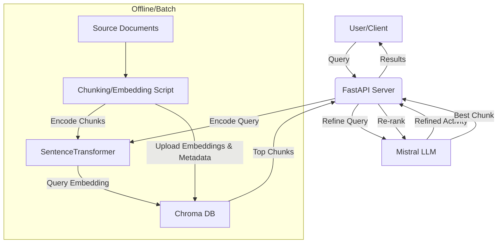

# BillQuant RAG Server (PAT)


## Architecture Diagram



The BillQuant RAG Server is designed for scalable, efficient, and maintainable retrieval-augmented generation (RAG) in a production environment. The system is composed of the following main components:

- **FastAPI**: Serves as the HTTP API layer, handling all client requests, CORS, and endpoint logic. It is stateless and does not load large data into memory at startup.
- **SentenceTransformer**: Used for encoding both document chunks (offline, during embedding) and user queries (online, at query time). The model is loaded lazily, only when needed, to minimize memory usage and speed up server startup.
- **Chroma DB (Cloud)**: All document embeddings and their metadata are stored in Chroma DB, a managed vector database. This allows for fast, scalable vector search without loading all embeddings into RAM. Only the relevant vectors are retrieved per query.
- **BM25**: (Optional) Used for keyword-based retrieval to complement semantic search, providing a hybrid approach for improved recall.
- **Mistral (LLM)**: Used for two purposes: (1) refining user queries into activity categories or synonyms, and (2) re-ranking retrieved results to maximize answer relevance.

### Key Design Principles
- **Separation of Concerns**: Chunking/embedding, storage, retrieval, and ranking are distinct steps/components.
- **Stateless API**: The server does not keep embeddings or large data in memory, making it lightweight and horizontally scalable.
- **Scalability**: The system can handle millions of chunks/activities without increasing RAM usage.
- **Security**: All sensitive credentials are stored in environment variables. CORS is restricted to trusted domains.

## Technical Strategy

1. **Document Preparation & Embedding (Offline/Batch):**
	- Source documents are parsed and chunked into activity blocks.
	- Each chunk is encoded into a vector using SentenceTransformer.
	- Chunks, embeddings, and metadata (e.g., activity code) are uploaded to Chroma DB. This is a one-time or periodic operation.

2. **Query Handling (Online/Runtime):**
	- User submits a query to the `/search_pat` endpoint.
	- The query is refined by Mistral to generate one or more activity categories or synonyms.
	- Each refined query is encoded into a vector.
	- Chroma DB is queried for the most similar chunks (semantic search). Optionally, BM25 keyword search is used for hybrid retrieval.
	- The top results are re-ranked by Mistral for relevance and accuracy.
	- The best-matching chunk(s) are returned to the user.

3. **No Embedding Loading at Startup:**
	- The server does not load all embeddings into RAM; it only loads the model and queries Chroma DB as needed.

## Workflow

**Embedding/Upload:**
1. Run `python rag_training.py` to parse, chunk, and encode your source documents.
2. Embeddings and metadata are uploaded to Chroma DB. No .pt files are needed at runtime.

**Serving/Query:**
1. Start the FastAPI server with Uvicorn.
2. User sends a query to `/search_pat`.
3. Query is refined and encoded, then sent to Chroma DB for vector search.
4. Results are re-ranked and returned.

## Why This Architecture?

- **RAM Efficiency:** Only the model and a few vectors are in memory at any time. The system is not limited by RAM, so it can scale to large datasets.
- **Horizontal Scalability:** Because the server is stateless and does not keep embeddings in memory, you can run multiple instances behind a load balancer.
- **Maintainability:** Each component (embedding, storage, retrieval, ranking) can be updated or replaced independently.
- **Security:** API keys and sensitive info are kept in environment variables. CORS is restricted.
- **Flexibility:** New documents/activities can be added by re-running the embedding script. Models or vector DBs can be swapped with minimal code changes.

---

## Development & Getting Started

### Prerequisites
- Python 3.11+
- Chroma Cloud account (API key, tenant, database)
- Docker (optional)

### Setup
1. Clone the repository.
2. Install dependencies:
	```sh
	pip install -r requirements.txt
	```
3. Create a `.env` file in `rag_server_pat/` with your Chroma credentials:
	```
	CHROMA_API_KEY=YOUR_API_KEY
	CHROMA_TENANT=YOUR_TENANT_ID
	CHROMA_DATABASE=Prod
	```

### Uploading Model Embeddings
Run the embedding script to chunk your source text, encode with SentenceTransformer, and upload to Chroma DB:
```sh
python rag_training.py
```
This will:
- Parse and chunk the source document(s)
- Encode each chunk as an embedding
- Upload all chunks and embeddings to Chroma DB with metadata (activity)

### Running the Server
Start the FastAPI server (single worker recommended for RAM efficiency):
```sh
uvicorn main:app --host 0.0.0.0 --port 8000 --workers 1
```

### API Endpoints
- `/health` — Health check
- `/search_pat` — POST endpoint for semantic search (form field: `query`)

### Technical Overview
- **No embeddings are loaded into RAM at server startup.** All retrieval is handled by Chroma DB.
- **Lazy model loading:** The SentenceTransformer model is loaded only when needed.
- **Chroma DB** is used for both uploading and querying embeddings, ensuring scalability and low memory usage.
- **Mistral** is used for query refinement and re-ranking, improving answer relevance.

### AI Strategy & Workflow
1. User submits a query to `/search_pat`.
2. Query is refined by Mistral to generate activity categories.
3. Each category is encoded and sent to Chroma DB for semantic search.
4. Top results are re-ranked by Mistral for accuracy.
5. The best-matching chunk(s) are returned to the user.

### Testing
- Run the embedding script and server as above.
- Test endpoints with curl, Postman, or your frontend:
  ```sh
  curl -X POST "http://localhost:8000/search_pat" -F "query=YOUR_QUERY"
  ```
- Check logs for errors or Chroma DB connection issues.

### Access & Security
- The server is CORS-restricted to `https://billquant-1.onrender.com` by default (see `routes.py`).
- Chroma DB credentials are stored in `.env` and should be kept secret.

### Dependencies
- fastapi
- uvicorn
- python-dotenv
- torch
- sentence-transformers
- rank-bm25
- numpy
- python-multipart
- chromadb

---
For more details, see the code in `rag_training.py`, `routes.py`, and `chroma_connection.py`.